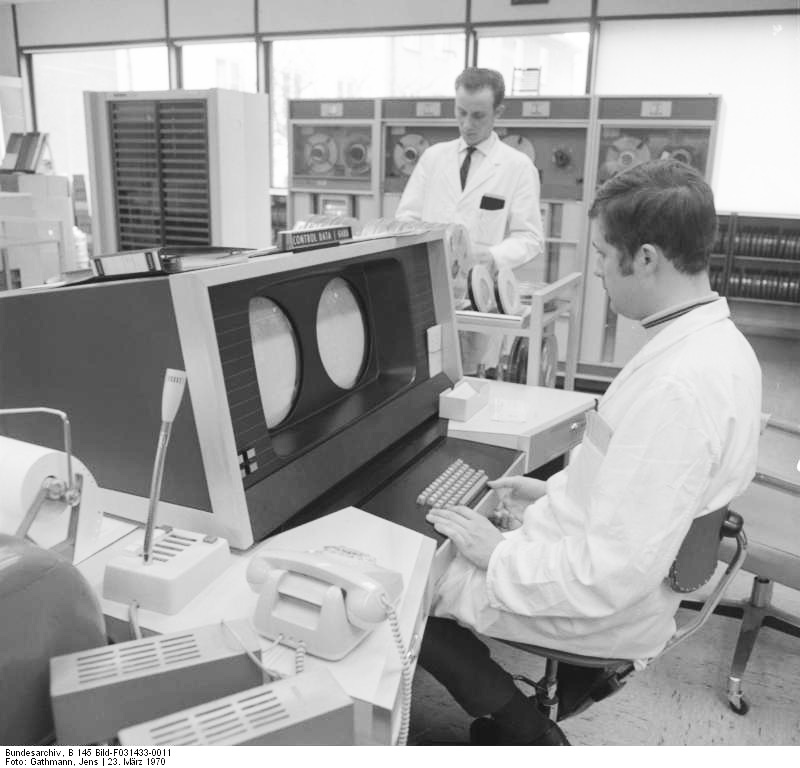

name: title-slide
class: center, middle, inverse
layout: true
---
name: section-slide
class: left, middle, inverse
layout: true
---
name: default
class: left, top
layout: true
---
name: title
template: title-slide

Debugging toolbox
=================
<p>&nbsp;</p>
Tools everybody would like to avoid
-----------------------------------
<p>&nbsp;</p>
Michael Schliephake, 2014-12-04

.footnote[
Navigate with arrow keys&nbsp;&nbsp;<-&nbsp;&nbsp;->]
---
## Outline

* Introduction

* Avoid debugging

* Demo

* Mini-Labb
---
class: center, middle, inverse
## Debugging


???
http://commons.wikimedia.org/wiki/File:H96566k.jpg
---
## Debugging

is using techniques to find and correct bugs

* Measures in order to avoid debugging
  * Develop algorithms in methodical way
  * Use assertions
  * Use logging

* Typical steps of systematic debugging
  * Make the problem reproduceable
  * Find the place where it is clear that something is wrong
  * Backtrack to the earliest place with a failure

* Types of Debugging
  * Interactive debugging
  * Post-mortem debugging

ATTN: Debugging changes the program run – have alternative ideas if needed
---
## Avoid debugging
* Develop algorithms in a methodical way
* Assertions - check the correctness of values, conditions

```C
#include <assert.h>

void func( int i, int j ) {
    assert( i + j > 5 );
    /* more work... */
}

int main( int argc, char *argv[] ) {
    func(2,3);
    func(3,3);
    return 0;
}
```
Compilation and execution of the program
```bash
$ gcc assert.c 
$ ./a.out
Assertion failed: (i + j > 5), function func, file assert.c, line 4.
Abort trap: 6
$ gcc -DNDEBUG=1 assert.c 
$ ./a.out
$
```
???
* Methodical way
  * paper, pen, excel, diagrams, sketches of data structures, UML
---
## Avoid debugging
* Defensive programming

```C
void func( int i, int j ) {
    if ( i + j > 5 ) {
        /* more work... */
    }
}
```

* Logging - *printf made fashionable*
  * Python: available in the standard library via `import logging`
  * C/C++: `log4c`, `log4cpp` Java: `log4j`
  * Characteristics
      - Create messages of different severity level: *info*, *debug*, ..., *fatal*
      - Configurable - get messages of a certain severity level, get messages from certain components in the program, turn logging on or off
      - Send output to different channels - screen, files, network...
* Unit testing, continuous integration
---
class: center, middle, inverse
## Demo Time



???
http://commons.wikimedia.org/wiki/File:Bundesarchiv_B_145_Bild-F031433-0011,_Aachen,_Technische_Hochschule,_Rechenzentrum.jpg
---
## Debugging - Execution control
<pre>
run/kill     r/k         start or terminate program

continue     c           continue execution after break

step         s           single step (into functions)

next         n           single step (over functions)

where                    print stacktrace

p varname                print content of variable

l srcFile.c:lineNumber   show the sourceode

Set Breakpoints
break        b           srcFile.c:lineNumber
break        b           functionName

watch varname            stop execution when the variable changes
</pre>
---
## Mini-Lab

Find and correct the bug in the program queue that has been demonstrated in the demo.

Open two terminal windows. Prepare one as the I/O window for the program:

```bash
$ tty
/dev/ttys003
$ sleep 10000
```

Compile the program and start the debugger in the other window. Use the tty name found above in order to redirect I/O of your program.

```bash
$ gcc -g -o queue queue.c 
$ gdb -q ./queue
Reading symbols for shared libraries .. done
(gdb) tty /dev/ttys003
(gdb)
```

URL of the source code: 
