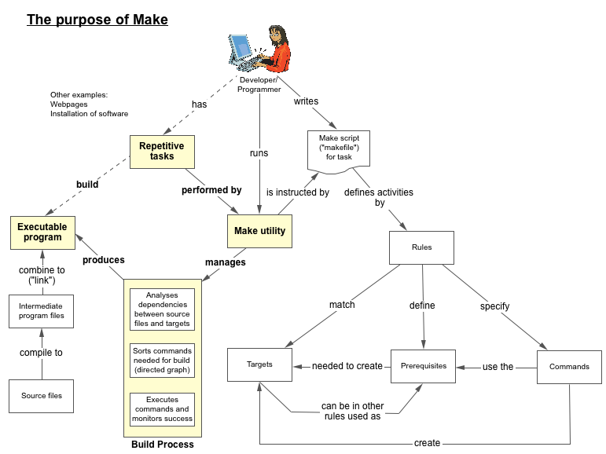
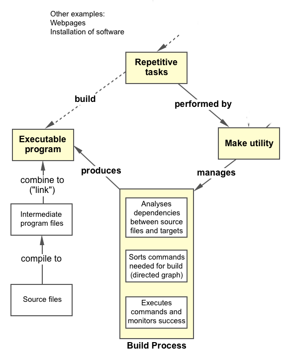
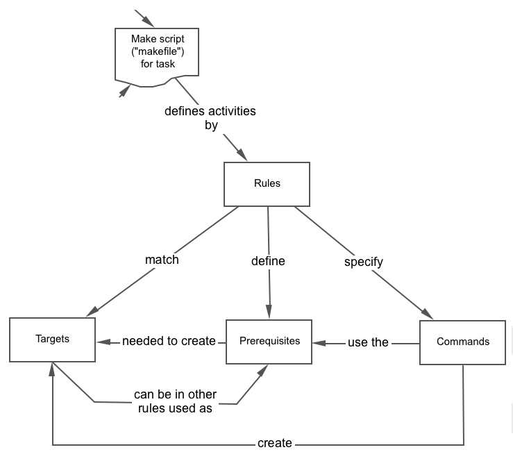

name: title-slide
class: center, middle, inverse
layout: true
---
name: section-slide
class: left, middle, inverse
layout: true
---
name: default
class: left, top
layout: true
---
name: title
template: title-slide

Building software with make
===========================
<p>&nbsp;</p>
Automation of repetitive work
-----------------------------
<p>&nbsp;</p>
Michael Schliephake, 2014-12-03

.footnote[
Navigate with arrow keys&nbsp;&nbsp;<-&nbsp;&nbsp;->]
---
## Outline

* Introduction
* Development of a build solution with make
* Advanced use of make

---
## Introduction

<center>

</center>
---
## Introduction
<center>

</center>
???
* build and install your package without knowing the details of how that is done
* not limited to building a package: install or de-install software, execute backups,...
* these details are recorded in the makefile that you supply.
* Make figures out automatically which files it needs to update, based on which source files have changed
* It also automatically determines the proper order for updating files
* Only parts need to be recompiled most often - save time
* Make is not limited to any particular language or compiler.
* Command for processing files can be provided - compile, link, run Latex, build website

---
## Make rules

<table><tr>
<td>
**Syntax of rules**
<pre>
target: dependencies ...
        commands
        ...
</pre>
<p>&nbsp;</p>
<small>Indent commands with <TAB> characters
</td>
<td></td>
</tr></table>

---
## Build automation

* Make
  * different versions: *GNU make* (Linux, OS X), *nmake* (MS Windows), ...
  * basic functionality standardized in POSIX definition
* GNU build tools (so-called "autotools")
  * increase portability
* Cmake
  * generate f.ex. makefiles

And more tools:<br/>[http://en.wikipedia.org/wiki/List_of_build_automation_software](http://en.wikipedia.org/wiki/List_of_build_automation_software)

----
### Useful links:
* Make homepage: [http://www.gnu.org/software/make/](http://www.gnu.org/software/make/)
* POSIX definition: [http://pubs.opengroup.org/onlinepubs/009695399/utilities/make.html](http://pubs.opengroup.org/onlinepubs/009695399/utilities/make.html)

---
## Using make

* Remember: Activities to solve the tasks (build a program) defined in rules
>     target: dependencies ...
>            commands
>            ...
* Save rules in a file, default names are **Makefile**, **makefle**, **GNUmakefile**.
* Activate make and specifyes desired targets to build as parameters
```bash
$ make all
```
  * For other makefile names use parameter `-f` 
```bash
$ make -f mymakefile all
```
---
## An application in need of a build based on make

*main.c*
```C
#include "func.h"

int main(int argc, char *argv[]) {
    function();
    return 0;
}
```

*func.h*
```C
void function(void);
```

*func.c*
```C
#include <stdio.h>

void function(void) {
    printf("Hello, world!\n");
}
```

```bash
$ gcc -o hello main.c func.c
```
---
## Makefile 1

```make
hello : main.c func.c func.h
    gcc -I. -o hello main.c func.c
```
* Very simple start - define commands for easy reproducability
* First rule in the file will be built when calling make without target
```bash
$ make -f makefile_01
gcc -I. -o hello main.c func.c
```
* Change of any file in the prerequisites will trigger rebuilt
---
## Makefile 2
```make
CC = gcc
CFLAGS = -I.

hello : main.o func.o
        $(CC) -I. -o hello main.o func.o
```
**Building**
```bash
$ make -f makefile_02
gcc -I.   -c -o main.o main.c
gcc -I.   -c -o func.o func.c
gcc -I. -o hello main.o func.o
```
* CC and CFLAGS are predefined macros for C compilation, CXX for C++ ...
* There is a default rule how to compile `.c` files to `.o` files
---
## Makefile 3

```make
CC = gcc
CFLAGS = -I.
HEADERS = func.h

hello : main.o func.o
    $(CC) -I. -o hello main.o func.o

%.o : %.c $(HEADERS)
    $(CC) $(CFLAGS) -c -o $@ $<
```

**Building**
```bash
$ make -f makefile_03 
gcc -I. -c -o main.o main.c
gcc -I. -c -o func.o func.c
gcc -I. -o hello main.o func.o
```

* Implicit rules allows customising the compilation of C files
* Adding HEADERS to the rule triggers rebuild for changes of .h files
* The special macro `$@` specifies the current target, `$<` selects the first prerequisite
---
## Makefile 4
```make
CC = gcc
CFLAGS = -I.
HEADERS = func.h
OBJ = hello.o func.o

hello : $(OBJ)
    $(CC) $(CFLAGS) -o $@ $^

%.o : %.c $(HEADERS)
    $(CC) $(CFLAGS) -c -o $@ $<
```
**Building**

```bash
$ make -f makefile_04
gcc -I. -c -o main.o main.c
gcc -I. -c -o func.o func.c
gcc -I. -o hello main.o func.o
```
* Generalisation of the rule for linking
* Special macro `$^` specifies all prerequisites
---
## Makefile 5

```make
INCDIR = ../include
LIBDIR = ../lib
OBJDIR = obj

CC = gcc
CFLAGS = -I$(INCDIR)
LIBS = -lm

HEADERS_LIST := func.h
HEADERS = $(patsubst %,$(INCDIR)/%,$(HEADERS_LIST))
OBJ_LIST = main.o func.o
OBJ := $(patsubst %,$(OBJDIR)/%,$(OBJ_LIST))

hello : $(OBJ)
        $(CC) $(CFLAGS) -o $@ $^ $(LIBS)

$(OBJDIR)/%.o : %.c $(HEADERS)
        $(CC) $(CFLAGS) -c -o $@ $<

.PHONY: clean

clean :
        rm -f $(OBJDIR)/*.o *~ core $(INCDIR)/*~
```

---
### Makefile 5

*Building*

```bash
$ make -f makefile_05 
gcc -I../include -c -o obj/main.o main.c
gcc -I../include -c -o obj/func.o func.c
gcc -I../include -o hello obj/main.o obj/func.o -lm
```

* Source, header and object files in different directories
---
## Flexible makefiles

---
## Makefiles in large projects

---
### Further Reading

* Robert Mecklenburg: Managing Projects with GNU Make. 3rd. edition. O'Reilly, 2004. (Freely available: [http://www.oreilly.com/openbook/make3/book/index.csp](http://www.oreilly.com/openbook/make3/book/index.csp)).
* Software Carpentry Tutorial for Make. [http://software-carpentry.org/v4/make/index.html](http://software-carpentry.org/v4/make/index.html).
* GNU make documentation: [http://www.gnu.org/software/make/manual/](http://www.gnu.org/software/make/manual/).
* Microsoft nmake documentation: [http://msdn.microsoft.com/en-us/library/dd9y37ha.aspx](http://msdn.microsoft.com/en-us/library/dd9y37ha.aspx).
