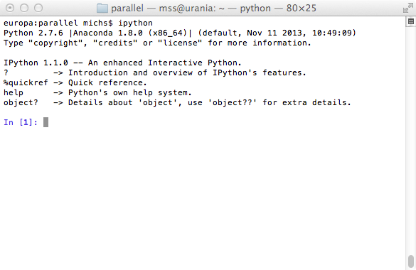
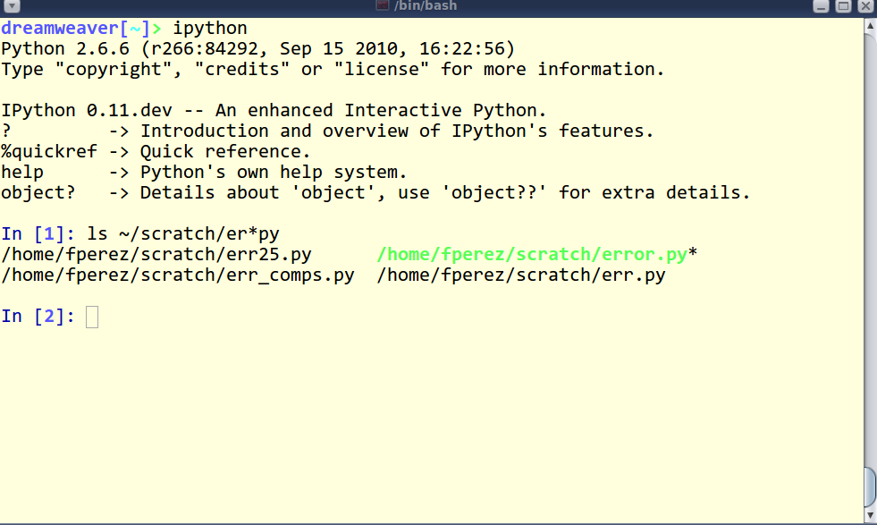
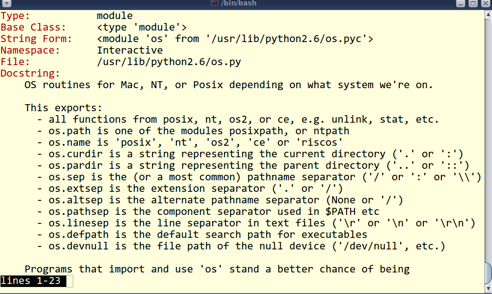
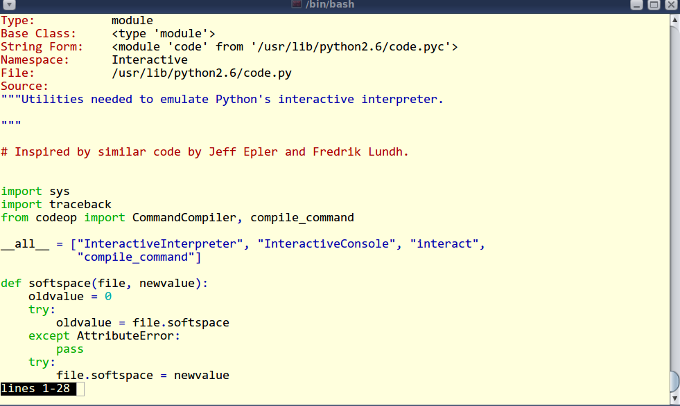
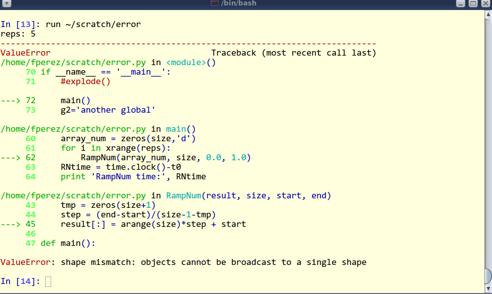
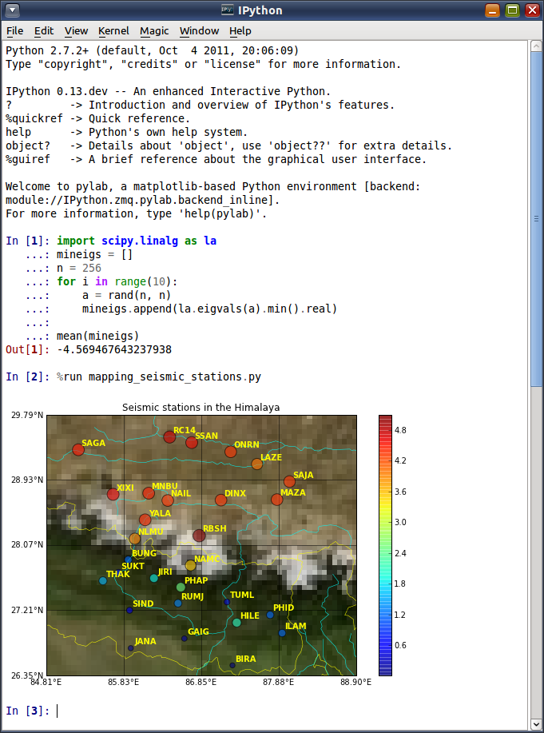
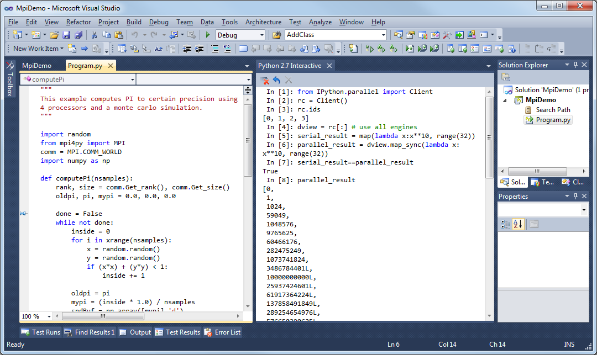
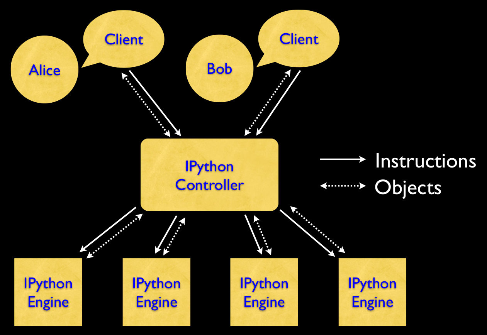

name: title-slide
class: center, middle, inverse
layout: true
---
name: section-slide
class: left, middle, inverse
layout: true
---
name: default
class: left, top
layout: true
---
name: title
template: title-slide

Working with IPython
====================
<p>&nbsp;</p>
An Invitation
-------------
<p>&nbsp;</p>
Michael Schliephake, 2014-12-02

.footnote[
Navigate with arrow keys&nbsp;&nbsp;<-&nbsp;&nbsp;->]
---
## General information

> ###IPython is interactive Python

* Exploration of data and programs
* Help for programming API
* Support for development
* Shell access
* Exchange of results
* Reproducable papers

<div>&nbsp;</div>
<div align="center">
<span style="font-size: 24px;">[**http://ipython.org**](http://ipython.org)</span>
</div>
---
## IPython clients


---
### Console client



---
### Console example



---
### Console example



---
### Console example



---
### Console example



---
### Qt console client



---
### Web notebook


---
### Microsoft Visual Studio integration



---

## IPython parallel computing


---
## Using notebooks in other formats

```bash
ipython nbconvert --to FORMAT notebook.ipynb
```

* HTML
* Latex, PDf
* Slides (reveal.js)
* Markdown, reStructuredText
* Python

* Notebook viewer [http://nbviewer.ipython.org/](http://nbviewer.ipython.org/)

---
## Installation of IPython

### Easy going
* Download and install a complete Python distribution
  * Anaconda [http://continuum.io/](http://continuum.io/)
  * Canopy [https://www.enthought.com/](https://www.enthought.com/)<br/></br>
  - Both free for academic use

### Installation on your own
* See: [http://ipython.org/ipython-doc/stable/install/index.html](http://ipython.org/ipython-doc/stable/install/index.html)

  * Want probably the **SciPy stack**: [http://www.scipy.org/about.html](http://www.scipy.org/about.html)
---
## The most important IPython commands...

...in the beginning

**?**         -> Introduction and overview of IPython's features.

**%quickref** -> Quick reference.

**help**      -> Python's own help system.

**object?**   -> Details about 'object', use 'object??' for extra details.

### Activities after installation

* Read about *magick functions*
* Look how to access the shell
* Explore *matplotlib*, *numpy* and *scipy*
---
name: demo
template: title-slide

# Demo time
